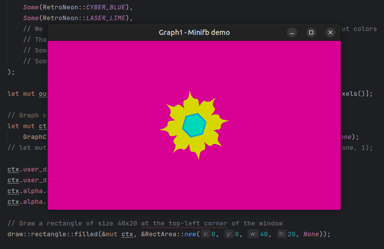

# Graph1

Graph1 is a zero-dependency Rust library for pixel-level 2D graphics, drawing, animation, and procedural effects. Designed for real-time applications, it provides primitives, geometry, drawing tools, effects, and font rendering utilities. It is suitable for games, demos, educational tools, or any project that requires software rendering with high control and precision.
- - - - - - - - - - - - 

- - - - - - - - - - - -

---

## ✨ Features

- **Zero dependencies** — no external crates used.
- **Cross-platform** — works on any platform with Rust support.
- **Multithreading** — parallel rendering for large framebuffers.
- **Compositing** — alpha blending with integer and float support.
- **Geometric Primitives** — lines, polygons, circles, bézier curves, etc.
- **Context-based API** — all the settings for drawing are available in one place.
- **Pixel Fonts** — supports  bitmap fonts for rendering text
- **Procedural Effects** — scanlines, glitch effects, white noise, gradients, etc.
- **Flexible Clipping** — built-in clipping strategies for line drawing.
- **Color Utilities** — palettes, conversion between 0RGB, RGBA, ABGR, etc.

---

## 🗺️ Roadmap

Please refer to the [ROADMAP.md](ROADMAP.md) for plans on future features and improvements.

---

## 📄 What Graph1 Is

- A **software renderer** for  2D graphics.
- A **toolkit** for manipulating pixels, shapes, and effects.
- A **real-time capable** drawing engine for dynamic visuals.


---

## ⛔️ What Graph1 is/does Not

- Does **not perform file I/O** (reading/writing images, fonts, etc.).
- Does **not maintain state** beyond its own context (@see [GraphContext](src/core/context/graph.rs)).
- Does **not depend on any OS, graphics API, or runtime**.

---

## 🖋️ Drawing Contexts

Graph1 uses context objects to separate responsibilities:

- `GraphContext` — main entry point: framebuffer, window, settings.
- `WindowContext` — defines screen size, center, color, quadrants.
- `LineContext` — manages anti-aliasing, thickness and rasterization of lines.
- `BezierContext` — control over how bézier curves are rendered.
- , `AlphaContext` — alpha blending settings

Each context can be programmatically configured at any point in runtime. Default values are provided for ease of use.

---

## 🌈 Colors and Pixels

- Graph1 uses RGBA model for color representation.
- The resulting framebuffer can be converted to other color models before being sent to the graphics output.

## 🚀 Multithreaded Rendering

Many Graph1 operations (e.g., buffer fill, scanline effect, rectangle drawing) can be executed in parallel. The `GraphContext.num_threads` controls how many threads are used:

- `0` → don't use any threads (i.e. do nothing)
- `1` → single-threaded
- `n > 1` → use `n` threads to divide workload

Some of the functions that support multithreading:

- `draw::tools::fill::buffer`
- `draw::rectangle::filled`
- `fx::scanline::window`
- `utils::color::adapters::rgba_to_0rgb`

---

## 🌐 Geometry and Drawing

Supported primitives and shapes:

- Lines (with clipping, anti-aliasing)
- Polygons (including stars and convex shapes)
- Circles and ellipses
- Bézier curves (with control rendering)
- Filled rectangles

Closed shapes can be flood-filled with a color

---

## 📅 Fonts and Text

Graph1 ships with pixel fonts embedded using the `CBF` (Compact Bitmap Font) format.

### Embedded fonts:

- `c_c_red_alert_inet0`
- `c_c_red_alert_inet1 (LAN)`

These fonts are parsed at runtime and rendered directly into the framebuffer.

### CBF format:

A binary format optimized for small size and fast parsing. It contains:

- Metadata: font name, author, kerning, size
- Character layout, widths, and pixel bitmap (1-bit)

> **Note:** Custom fonts can be made using the [CBF generator]\([https://github.com/dipdowel/compact-bitmap-font](https://github.com/dipdowel/compact-bitmap-font)) .

---

## ⚒️ Utilities

- `utils::math::rng` — deterministic and random generators
- `utils::math::geometry::region` — bounding regions for layouts
- `utils::color::adapters` — fast color format conversions
- `utils::color::palettes` — predefined color palettes
- `utils::pixel_copy::image_data` — copy and transform raw buffers

---

## ⚠️ Safety and Performance Notes

- All rendering happens in system memory — no GPU (unless you enable experimental GPU support via the `gpu` feature flag).
- Unsafe operations are avoided unless performance requires it.
- Custom numeric traits are used (`Numeric`) to support generic math.
- Tests are included to verify precision and corner cases.

---

## ✨ Examples and links

- [https://github.com/dipdowel/graph1\_wasm\_demo](https://github.com/dipdowel/graph1_wasm_demo/)
  - A collection of demos implemented with Graph1
  - Guides and tutorials
  - See it in action on [https://graph1.codument.com](https://graph1.codument.com/?demo=0)
- [https://github.com/dipdowel/graph1\_app\_template](https://github.com/dipdowel/graph1_app_template)
  - A bare-minimum app template to kick off your Graph1 project.
- [https://github.com/dipdowel/graph1\_minifb\_demo](https://github.com/dipdowel/graph1_minifb_demo)
  - Run demos from \`graph1\_wasm\_demo\` locally using \`minifb\`&#x20;
- [https://github.com/dipdowel/compact-bitmap-font](https://github.com/dipdowel/compact-bitmap-font)
  - Compact bitmap font generator. Such fonts can be rendered by Graph1.

## Experimental GPU support.
- There is a highly experimental GPU support in Graph1, which is enabled by the `gpu` feature flag.
- The GPU is utilized by means of OpenCL (which may not be the optimal choice, but hey, an experiment is an experiment!).

### Prerequisites
#### Linux, Intel iGPU
```sh
sudo apt-get install intel-opencl-icd ocl-icd-opencl-dev clinfo ocl-icd-libopencl1 opencl-headers
```

#### Linux, AMD iGPU
1. [Find and install](https://www.amd.com/en/support/download/drivers.html) the latest AMD drivers for your system
2. 
```sh
sudo amdgpu-install
# or
sudo amdgpu-install --opencl=legacy,rocr
# then
sudo apt-get install  ocl-icd-opencl-dev clinfo ocl-icd-libopencl1 opencl-headers 
```

---

## 🎓 License

Graph1 is open-source. See file [LICENSE](LICENSE).

---

## 🚨 TODOs
- Add documentation on custom font loading


<br /><br />
- - - - - - - - - - - - - - - - - - - - - - - - - - - - - - - - - - - - - - - - - - - - - - - - - - - - - - - - - - - - 

## NB: Below is an older version of the README.md file. 
It contains some useful bits which need to be cleaned up, reorganized, and incorporated into the new version (above).

- - - - - - - - - - - - - - - - - - - - - - - - - - - - - - - - - - - - - - - - - - - - - - - - - - - - - - - - - - - -
<br /><br /><br />

# Graph1

**Application code** is code that uses Graph1 library.

## What Graph1 is and what it does
- Graph1 is a zero-dependency library for producing and manipulating graphical primitives, e.g. lines, curves,
  simple geometric shapes. It also can render texts using pixel fonts.
- Graph1 can be used for creating static images, animations, 2D computer game graphics (non-GPU), etc.

## What Graph1 is not and what it does not do
- Graph1 does not read or write files, but it can accept data from files read by your application code.
- Keeping any static state is outside the scope of Graph1. This should be done in the application code. 

## Working with color
At the moment of writing, `Graph1` uses `0RGB` encoding for a pixel, which means that the upper 8-bits are ignored, 
the next 8 bits are for the R channel, then 8 bits for the G channel, and the last 8 bits for the B channel. This helps
to avoid any extra conversion while working with library `minifb`.

Eventually, we may move to `ARGB` model, but that's not the case now.


## Multithreaded operations
Some operations in Graph1 can be performed in parallel. For example, filling a buffer with a color, copying one buffer to another, etc.
The buffer gets split into chunks, and each chunk is processed by a separate thread. In lower-level functions, 
the number of threads must be passed explicitly. In higher-level functions, the number of threads to spawn read taken from `GraphContext.num_threads`.

Here's a list of functions that support multithreading:
- `draw::tools::fill::buffer()` - fills a buffer with a color
- `draw::rectangle::filled()` - draws a filled rectangle
- `fx::scanline::window()` - applies a scanline effect to a window
- `utils::color::adapters::rgba_to_0rgb::rgba_to_0rgb()` - converts an RGBA buffer to 0RGB
- To be continued...

### `num_threads == 0`
Graph1 will not perform the multithreaded operation at all (in most cases this is not what you want).

### `num_threads == 1`
Graph1 will use only the main thread to perform the operation

### `num_threads > 1`
Graph1 will spawn `num_threads` threads to perform the operation. The relevant buffer(s) will be split into `num_threads` chunks, 
and each chunk will be processed by a separate thread. Main thread will wait for all the spawned threads to finish their work.


## Fonts

### Default embedded fonts
By default, the following pixel fonts are available in Graph1 framework:
- `c_c_red_alert_inet0` by [N3tRunn3r](https://forums.cncnet.org/profile/30740-n3trunn3r/)
- `c_c_red_alert_inet1 (LAN)` by [N3tRunn3r](https://forums.cncnet.org/profile/30740-n3trunn3r/)

The default fonts are stored in the Graph1 sourcecode and are encoded in CBF format (see below).
They are embedded directly into a compiled application using `include_bytes!()`. 

It is also possible to load and use your custom pixel fonts (see section "Using custom pixel fonts").

### CBF font format
"CBF" stands for "Compact Bitmap Font". It is a simple non-compressed binary format for storing pixel fonts as raw binary data.
An CBF-file contains a header with metadata and some data sizes, and a body with some textual information 
and the bits representing the font itself.  

#### The header
Header consists of a bunch of `u16` values:
-----------------------------------------------------------------------------------
- [0x0] - magic number `CBF0` for "Compact Bitmap F0nt"
- [0x1] - version of CBF format
- [0x2] - size of `font_name`, size of the name of the font
- [0x3] - size of `author_signature`, size of the author's name
- [0x4] - size of `char_order`
- [0x5] - size of `char_width`
- [0x6] - font image width
- [0x7] - font image height
- [0x8] - spacing props: lower byte -- kerning, higher byte -- leading.
- [0x9] - UTF8 default char: lower 2 bytes.
- [0xa] - UTF8 default char: higher 2 bytes.
- [0xb] - version of the font
- [0xc] - date: year
- [0xd] - date: lower byte -- day, higher byte -- month.
-----------------------------------------------------------------------------------

 
#### The body
The font body consists of a few fields of variable length. All the lengths are listed in the header.

Font body fields:
- `font_name` - A string with the name of the font.
- `author_signature` - A string with the name of the author of the font.
- `char_order` - order of characters in the font.
- `char_widths` - how many pixels wide each char is. The order of values matches the order of chars in `char_order`
- `font_pixel_data` - 1-bit image data of the font (0 for black, 1 for white)
  
### CBF parsing
Graph1 parses an

### Creating and/or using your own pixel fonts
- `TODO:` Come up with how to create and add custom fonts 
- `TODO:` Explain how to add custom fonts, etc. 
 